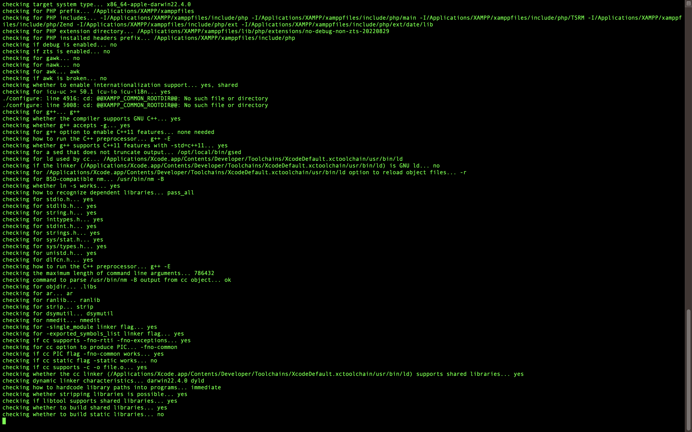
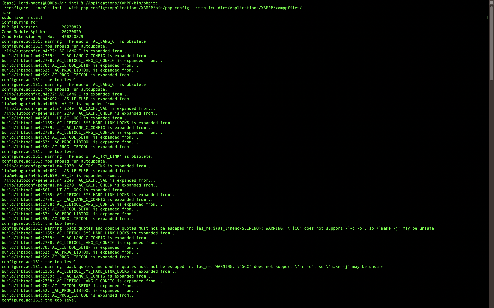
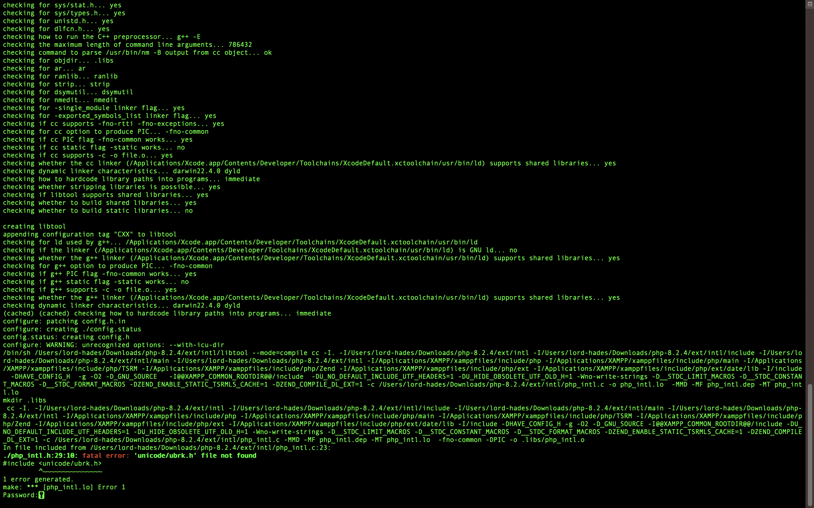
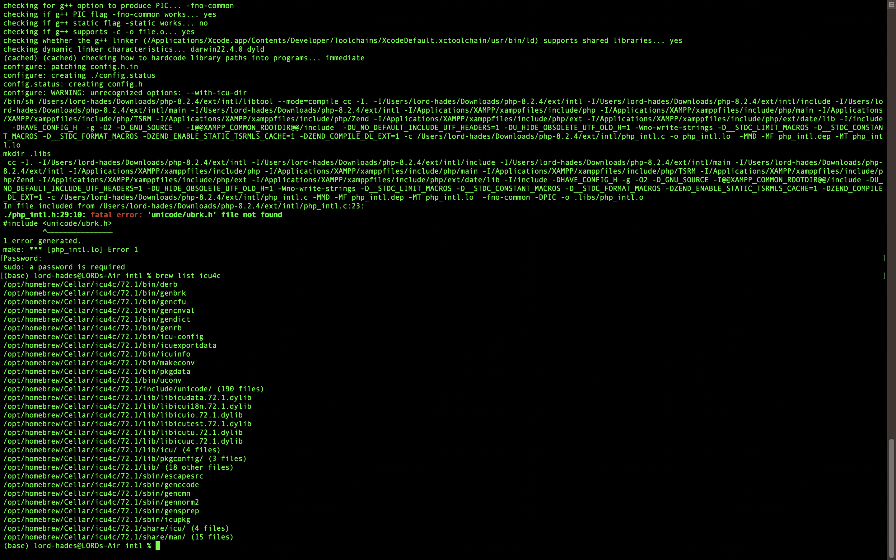
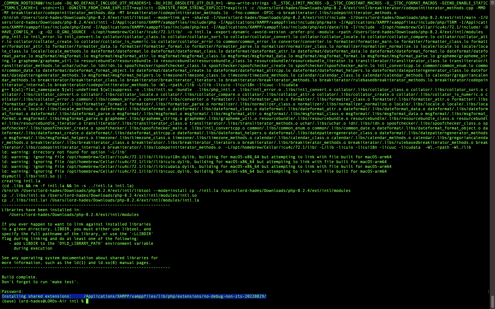
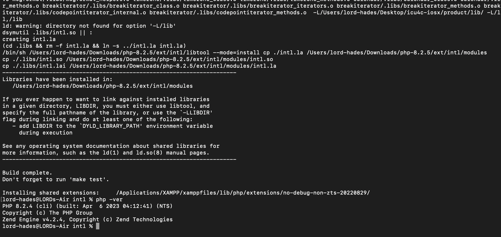

[MAC M1/M2 (SILICON CHIP) PHP INTL FIX]


DOWNLOAD PHP version you use from https://php.net  extract the file using 

1. `tar -xvf php-version.tar.gz `
2. `cd php-version`
3. `cd ext`
4. `cd intl`

5. `open your application folder, go to utilities set the terminal to be open with rosetta 2 so it would be comipiled into x86_64 instead of arm64.`

6. `open terminal`

7. `
/Applications/XAMPP/bin/phpize
./configure --enable-intl --with-php-config=/Applications/XAMPP/bin/php-config --with-icu-dir=/Applications/XAMPP/xamppfiles/
make
sudo make install 
`

```
FIX: ./php_intl.h:31:10: fatal error: 'unicode/ubrk.h' file not found

[1] brew list icu4c
[2] export CPPFLAGS=-I/opt/homebrew/Cellar/icu4c/72.1/include/
[3] export LDFLAGS=-L/opt/homebrew/Cellar/icu4c/72.1/lib/
```

7. `Open /Applications/XAMPP/xamppfiles/etc/php.ini , and
 add
extension=intl.so`


ERROR  
```
PHP Startup: Unable to load dynamic library 'intl.so' (tried: /Applications/XAMPP/xamppfiles/lib/php/extensions/no-debug-non-zts-20220829/intl.so (dlopen(/Applications/XAMPP/xamppfiles/lib/php/extensions/no-debug-non-zts-20220829/intl.so, 0x0009): symbol not found in flat namespace '__ZN6icu_7210DateFormat22createDateTimeInstanceENS0_6EStyleES1_RKNS_6LocaleE'), /Applications/XAMPP/xamppfiles/lib/php/extensions/no-debug-non-zts-20220829/intl.so.so (dlopen(/Applications/XAMPP/xamppfiles/lib/php/extensions/no-debug-non-zts-20220829/intl.so.so, 0x0009): tried: '/Applications/XAMPP/xamppfiles/lib/php/extensions/no-debug-non-zts-20220829/intl.so.so' (no such file), '/System/Volumes/Preboot/Cryptexes/OS/Applications/XAMPP/xamppfiles/lib/php/extensions/no-debug-non-zts-20220829/intl.so.so' (no such file), '/Applications/XAMPP/xamppfiles/lib/php/extensions/no-debug-non-zts-20220829/intl.so.so' (no such file))) in Unknown on line 0

```

FIX FOR THIS ERROR:

`git clone --recursive https://github.com/apotocki/icu4c-iosx`

`cd icu4c-iosx`

`everything would be built on the product folder so you need to export the path of that where it is located.`

[2] export CPPFLAGS=-I/icu4c-iosx/produt/include/
[3] export LDFLAGS=-L/icu4c-iosx/lib/


REFERENCES `[`https://github.com/apotocki/icu4c-iosx`]`: 

REFERENCES:
`[`https://medium.com/@agaetis/solved-install-intl-php-extension-for-xampp-and-magento-for-macos-mojave-41fa42336fc6`]`


`export CPPFLAGS=-I/usr/local/Cellar/icu4c/ver/include/`
`export LDFLAGS=-L/usr/local/Cellar/icu4c/ver/lib `

`[`https://stackoverflow.com/questions/66844482/unicode-ubrk-h-file-not-found-on-mac-osx-big-sur`]`


Screenshots:

1. 

2. 

3. 

4. 

5. 

5. 


You can also try copying my built intl.so to your xampp folder